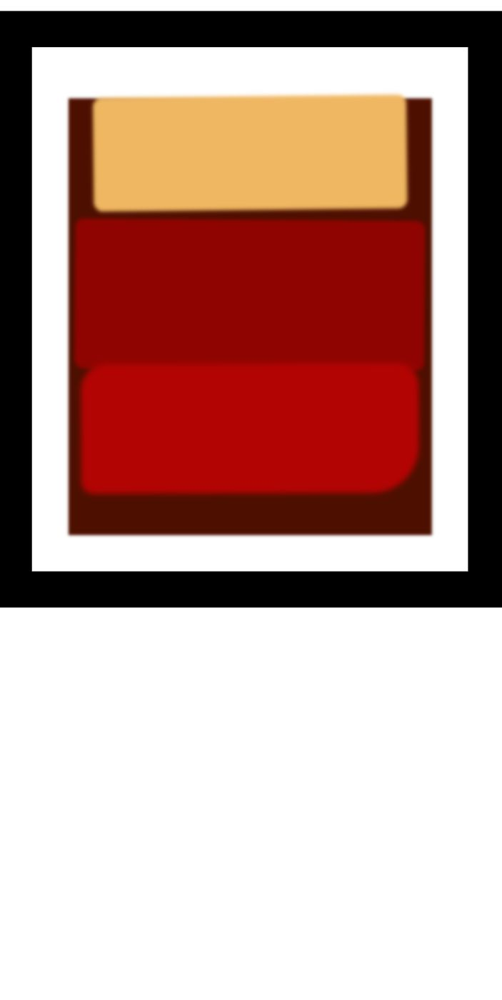

# 🎨 Pintura de Rothko - FCC


Este proyecto recrea una **pintura abstracta inspirada en Mark Rothko** utilizando únicamente **HTML y CSS**.

Forma parte de los ejercicios del curso **Responsive Web Design** de FreeCodeCamp y tiene como objetivo practicar el **CSS Box Model**, márgenes, padding y bordes para construir composiciones visuales.

---

## 🚀 Demo

[](https://carlosdm121.github.io/pintura-de-rothko-fcc/)

---

## 🖼 Vista del proyecto



---

## 🛠 Tecnologías utilizadas

<p>

</p>

- HTML5  
- CSS3  

---

## 📂 Características

✔ Recreación de una pintura abstracta con CSS  
✔ Uso del **CSS Box Model**  
✔ Manipulación de márgenes y padding  
✔ Construcción visual sin imágenes  
✔ Proyecto ligero sin frameworks

---

## 📦 Instalación

1. Clonar el repositorio

```bash
git clone https://github.com/carlosdm121/pintura-de-rothko-fcc.git
```

2. Entrar en la carpeta

```
cd pintura-de-rothko-fcc
```

3. Abrir el archivo

```
index.html
```

---

## 📚 Aprendizajes del proyecto

Este proyecto permite practicar:

- CSS Box Model
- Diseño visual con CSS
- Posicionamiento de elementos
- Composición artística en la web

---

## 👨‍💻 Autor

Desarrollado por **Carlos Daniel Martínez**

🔗 GitHub  
https://github.com/carlosdm121
